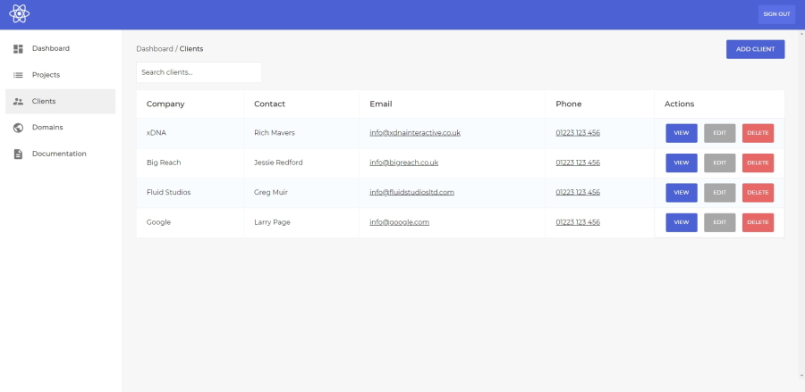

# Tracker

A holistic dashboard for development agencies to track customers and projects.

## Description

A holistic dashboard application that acts as a complete client, domain and project tracker for development agencies. Users can add, edit and delete resources, as well as assigning domains to clients, and clients to projects. Features include a realtime markdown parser for the documentation section, relational projects and authentication.

## Motivation

This project was learn about building real-world applications that solve problems for businesses whilst learning more about React, authentication, network requests and overall application development.

## Technologies

- JavaScript.
- React.
- Sass (BEM).
- React Query.
- Firebase.

---

This project was bootstrapped with [Create React App](https://github.com/facebook/create-react-app).

### Available Scripts

In the project directory, you can run:

#### `npm start`

Runs the app in the development mode.\
Open [http://localhost:3000](http://localhost:3000) to view it in the browser.

The page will reload if you make edits.\
You will also see any lint errors in the console.

#### `npm test`

Launches the test runner in the interactive watch mode.\
See the section about [running tests](https://facebook.github.io/create-react-app/docs/running-tests) for more information.

#### `npm run build`

Builds the app for production to the `build` folder.\
It correctly bundles React in production mode and optimizes the build for the best performance.

The build is minified and the filenames include the hashes.\
Your app is ready to be deployed!

See the section about [deployment](https://facebook.github.io/create-react-app/docs/deployment) for more information.
